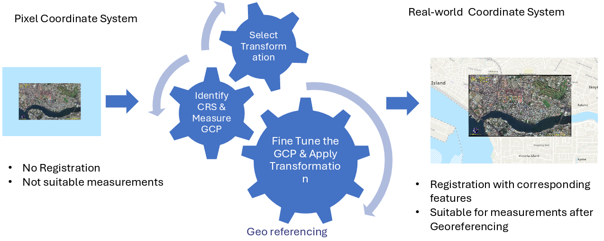
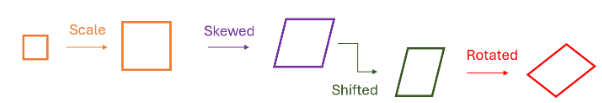

# Georeferencing

## Concept and Definition of Georeferencing
Georeferencing is the process of assigning real-world geographic coordinates to spatial data such as scanned maps, aerial photographs, satellite images, or drone-acquired imagery. 
It helps create a spatial relationship between the image’s pixels and the geographic location of the Earth’s surface, thus enabling the integration of diverse datasets with a single reference system 
[@Huisman2009]. This technique helps ensure that spatial data is correctly related to its location on the Earth’s surface, thus being useful for decision-making and spatial analysis.

Georeferencing is the backbone of a GIS, as all other processes and functions, such as distance calculation, overlay, or change detection, depend on it. 
Without georeferencing, the data will exist independently in the coordinate space, and it will be impossible to compare and combine them. For instance, a scanned map of the topographic surface will be impossible 
to compare with satellite images or cadastral boundaries if it is not georeferenced.

)*](figures/geo_intro.png){#fig-geo fig-align="center" width=70%}

In practical terms, georeferencing can be viewed as a transformation between image coordinate systems (row and column indices) and Earth-based coordinates (latitude, longitude, or projected coordinates such as UTM Easting and Northing). 
The transformation process often involves identifying a set of known control points, which are used to compute mathematical relationships between the image and real-world coordinate systems [@campbell2011].

## The Need and Importance of Georeferencing
The accuracy and reliability of the results obtained using a GIS depend on the quality of the geospatial data alignment with the real world. Georeferencing is the process of ensuring that the data has a common spatial reference system, 
which is essential in integrating different types of data, such as satellite images, GPS field data, and existing geospatial data [@wilson2008]. Without georeferencing, it is possible that results can be inaccurate due to improper data alignment.

{#fig-geo fig-align="center" width=70%}

Georeferencing is particularly important since the source data is, in many instances, based on analog maps developed before the era of digital cartographic tools. In fact, these maps, which are normally in paper or soft copy formats, 
have to be georeferenced in order to conform to the current standard systems, for example the Universal Transverse Mercator system based on the World Geodetic System 1984. The technique is not only vital in the context of national mapping 
and spatial planning but also in the integration of historical archives with new data obtained from satellite and aerial sources. For example, it is possible to study changes in land cover and urban growth by georeferencing the 1970s 
topographic maps with Sentinel-2 satellite images. Without georeferencing, it would not be possible.

## Coordinate Systems and Map Projections

A coordinate system is used as a guide for locating the position of geographic features on the surface of the Earth. Georeferencing involves the allocation of coordinates to each pixel or feature. 
Coordinate systems can be categorized into geographic coordinate systems and projected coordinate systems [@albrecht2007]).

### Geographic Coordinate System
The geographic coordinate system (GCS) is defined as the system of coordinates that uses angular measurements of latitude and longitude to define positions on the surface of the Earth, modeled as a spheroid or ellipsoid. 
The most common geographic datum used worldwide is the World Geodetic System of 1984 (WGS84). Nevertheless, various nations, including India, used their own geographic systems, such as the Everest Datum, based on Everest ellipsoid.

### Projected Coordinate System
The projected coordinate system (PCS) is defined as the system that transforms the curved surface of the Earth to a plane using mathematical formulas. The most common PCS is the Universal Transverse Mercator (UTM) projection, 
where the world is divided into 60 zones, each 6° wide in longitude. India is located within UTM Zones 42N to 47N. The PCS is mostly used for calculating distances and areas, which cannot be accurately done using angular measurements 
used in Geographic Coordinate System.

### Relationship between Datum, Projection, and Coordinate System
It is important to note that a coordinate system is considered complete when both datum and projection parameters have been considered. Inconsistency in datum, such as when data is in National Geodeatic Reference Frame (NGRF) Datum on WGS84 Elliposid is overlaid on Everest datum, 
can cause positional inaccuracies of up to hundreds of meters. Therefore, it is important to take note of all coordinate references when georeferencing data.

## Ground Control Points (GCPs): Role and Selection

Ground Control Points, or GCPs, refer to precise locations that can easily be identified on the image as well as the actual scene. GCPs play an important role in the georeferencing process, 
as they form the basis for the computation of the transformation parameters that connect the two coordinate systems, the image coordinates, and the actual scene coordinates (Richards, 2013). GCPs have an important bearing on 
the quality of the georeferencing process.

{#fig-geo fig-align="center" width=70%}

###	Characteristics of Good GCPs

- Permanence: The features used as GCP should remain unchanging over time, e.g., intersections of roads, corners of buildings, or monuments.
- Clarity: The features  used as GCP should be easily identifiable both on the image and the corresponding map.
- Distribution: The GCPs should be evenly distributed over the image to reduce distortion effects.
- Accuracy: The coordinates should be derived from reliable sources, e.g., GNSS measurements in the field or official topographic project databases.

### Sources of GCPs

GCPs can be collected from the following sources:
- GPS measurements in the field using GNSS survey techniques for high accuracy.
- Existing datasets that have been previously georeferenced, e.g., existing topographic maps or orthophotos.
- Publicly available online portals offering geospatial information, e.g., satellite base maps.

## Transformation Models in Georeferencing

Transformation models specify the mathematical relationship between the image coordinates (row, column) and the real-world coordinates (X, Y). These equations compensate for the distortions and ensure that the raster image is properly 
registered with the known positions on the ground [@Huisman2009]. The type of transformation model depends on the amount of distortion, the quality of the control points, and the spatial attributes of the source data.

The general form of the transformation model is:

$$
X' = f(x, y)
$$

$$
Y' = g(x, y)
$$

Where:

- \(x, y\) = coordinates in the image (pixel or line coordinates)  
- \(X', Y'\) = corresponding real-world coordinates (map projection coordinates)  
- \(f, g\) = transformation functions, which vary depending on the chosen model

The selection of transformation function determines how the image is scaled, skewed, shifted and rotated. These transformation models differ in their complexity and suitability depending on the type of distortion present in the original data.

{#fig-geo fig-align="center" width=70%}

### Similarity (Conformal) Transformation

The Similarity Transformation, often referred to as the Helmert or Conformal Transformation, is a specific form of the affine model that applies translation, uniform scaling, and rotation, 
while preserving the shape and angles of the original features [@richards2013, @albrecht2007]. Unlike the general affine transformation, which allows independent scaling and shearing along the x and y axes, 
the similarity transformation constrains the scale to be the same in both directions.

This model is particularly useful when:
- The dataset requires alignment but not distortion.
- The original geometry must be preserved (for example, engineering drawings, cadastral data, or orthophotos).
- Only uniform scale and rotation differences exist between the image and the map coordinate system.

It is therefore ideal for survey mapping and local map registration where shape fidelity is critical.

The general equations for a two-dimensional similarity transformation are:

$$
X' = a + s(x\cos\theta - y\sin\theta)
$$

$$
Y' = b + s(x\sin\theta + y\cos\theta)
$$

where:

- \(a, b\) — translation parameters (shift of origin)  
- \(s\) — uniform scale factor  
- \(\theta\) — rotation angle (in radians)

A minimum of two Ground Control Points (GCPs) is required to compute these parameters, although more are typically used for redundancy and error minimization via least-squares adjustment

## Affine Transformation

Affine transformation is the simplest and most widely used georeferencing model. It preserves straight lines and parallelism but not necessarily distances or angles. This model is suitable for most scanned maps, orthophotos, 
and satellite imagery where geometric distortions are minimal and primarily linear. Affine transformation can model translation, rotation, scaling, and shearing of the image. The mathematical form of an affine transformation is linear and defined by two equations:

$$
Y' = b_0 + b_1x + b_2y
$$

where:

- \(a_0, b_0\) = translation parameters (shifts in \(x\) and \(y\) directions)  
- \(a_1, b_2\) = scaling and rotation parameters  
- \(a_2, b_1\) = shearing parameters  

A total of six parameters \((a_0, a_1, a_2, b_0, b_1, b_2)\) are required, which can be solved using **at least three Ground Control Points (GCPs)**.

### Explanation of the Components

#### Translation
Moves the image origin to a new location without changing its shape.

$$
X' = x + \Delta X
$$

$$
Y' = y + \Delta Y
$$

#### Scaling
Changes the size of the image in the \(x\) or \(y\) direction.

$$
X' = s_x x
$$

$$
Y' = s_y y
$$

#### Rotation
Rotates the image by an angle \(\theta\) around the origin.

$$
X' = x\cos\theta - y\sin\theta
$$

$$
Y' = x\sin\theta + y\cos\theta
$$

#### Shearing
Distorts the image such that axes remain parallel but not perpendicular.

$$
X' = x + k_x y
$$

$$
Y' = y + k_y x
$$

where \(k_x\) and \(k_y\) are shear coefficients.

Combining all these transformations yields the **affine transformation equations** shown above.